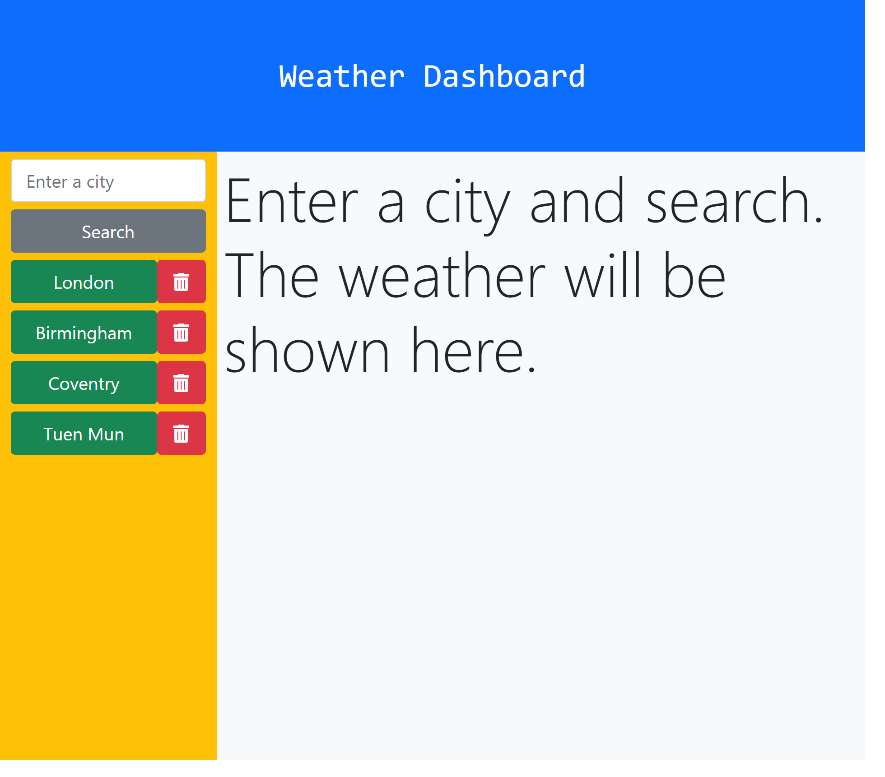
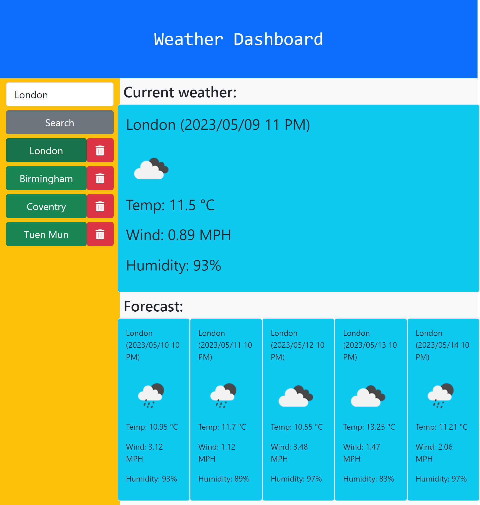
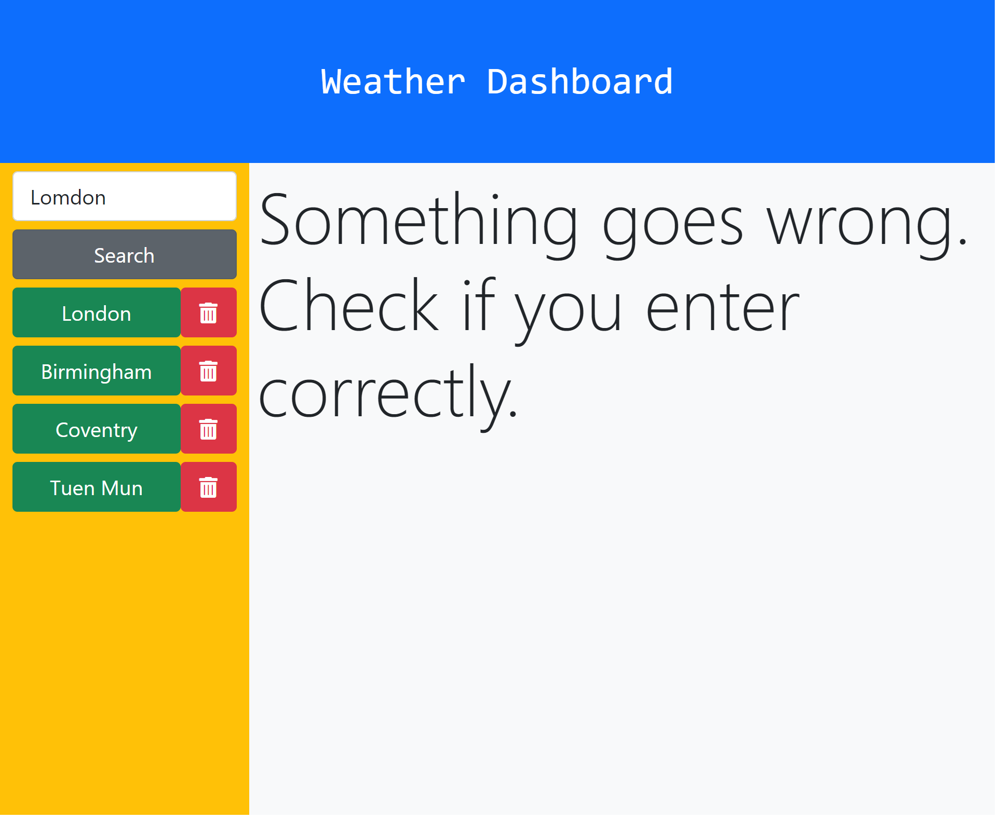

# weather-dashboard

I use the 5 Day Weather Forecast API to to retrieve weather data for cities and present it as a dashboard.

## Functionalities

When I search for a city, then I am presented with current and future conditions for that city and that city is added to the search history; when I view current weather conditions for that city, then I am presented with the city name, the date, an icon representation of weather conditions, the temperature, the humidity, and the the wind speed; when I view future weather conditions for that city, then I am presented with a 5-day forecast that displays the date, an icon representation of weather conditions, the temperature, the wind speed, and the humidity; when I click on a city in the search history, then I am again presented with current and future conditions for that city.

## Features

The dashboard consists of a left panel and a right panel. The left panel shows the input field, the search button and the history buttons, the right hand panel shows the current weather and weather forecasts.

### Left Panel

When the page is loaded, historical data will be drawn from localStorage and history buttons will be rendered, so that when you click on these buttons directly, the corresponding weather data will be shown on the right.

You first enter the name of a city in the input field. If data can be found for that name, the data will be displayed on the right and a history button will be created for that name if it's a new search; otherwise, a warning message will be shown on the right and no history button is created. Besides each history button, a trash button is used to delete that button, and the record about that city will also be deleted as well.

### Right Panel

When the page is loaded, a message on this panel is shown to instruct how to use the dashboard.

Data is drawn from APIs. The top part of the right panel shows the current data, and the bottom part shows the weather forecast. When there is a new search of city, the right panel will be refreshed and the new weather data is presented. When an invalid search is made, a warning message will be shown on the right panel.

